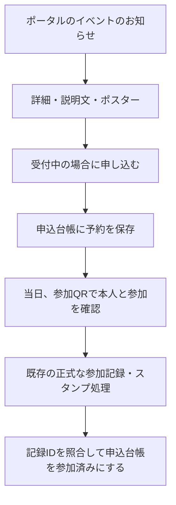

# 水曜会 イベント申込台帳の設計案

本番未実装。2026年9月4日改訂。初期の検証はイベント設定・申込一覧の2枚に限定し、架空データで行う。実イベントの定員などは募集前に確定する。

申込みを開催前の予約として保存し、当日の参加記録とは分ける。申込みだけでは参加スタンプ・指導碁スタンプを付けない。現在のイベント見本、正式受付台帳、花図鑑、既存の番号と記録は変更しない。

## 1. 台帳の分け方

正式受付台帳と別管理にする。最初の検証では「水曜会 テスト専用 イベント設定」「水曜会 テスト専用 申込一覧」の2ファイルだけを用意する。申込一覧に枠ID列を用意して空欄とし、先生・時間帯別の「申込枠」シートは将来拡張時に追加する。以下の3シート構成は拡張後の設計。

| シート | 1行の意味 | 用途 |
| --- | --- | --- |
| イベント設定 | 1つのイベント | 案内内容、募集状態、申込区分を管理 |
| 申込枠 | イベント内の1つの枠 | 枠ID、先生・時間帯などを管理。初期案ではイベントごとに共通枠を1つだけ用意 |
| 申込一覧 | 1人の1イベントへの申込み | 予約名簿、変更・キャンセル、当日の照合 |

ポスターや説明文はイベント設定に1回だけ登録し、申込者ごとの行に複製しない。参加者の氏名や希望内容を公開ページへ出さず、イベントの公開項目だけを表示する。

## 2. イベント設定

| 項目 | 必須 | 設計 |
| --- | --- | --- |
| イベントID | 必須 | 同じイベントでは固定。日時を訂正しても変えない |
| イベント名 | 必須 | 交流戦、指導碁＆定例会など |
| 開催日 | 必須 | 日付型で保存 |
| 開始時刻 | 必須 | 日本時間。例：12:30 |
| 会場 | 必須 | 会場名を文章で保存 |
| 指導棋士 | 任意 | 指導碁がある場合のみ |
| 告知文（説明文） | 任意 | コピーした文章・改行を保持。数式やHTMLとして実行しない |
| ポスター画像URL | 任意 | 1イベント1枚。画像本体は画像用の保存先に置き、台帳は公開表示用URLを持つ。端末内の一時URLは保存先にしない |
| 申込区分 | 募集時必須 | イベントごとに選択肢を設定 |
| 希望内容の案内 | 任意 | 必要なイベントだけ入力欄を表示 |
| 募集設定 | 必須 | 準備中／受付許可／再開待ち／締切。初期値は準備中。キャンセル後は再開待ち。実際の公開状態は日時・残席も合わせて判定する |
| 申込開始日時 | 募集時必須 | 日本時間。設定した時刻より前には保存を受け付けない |
| 締切日時 | 任意 | 日本時間。未設定なら管理者の締切操作まで。設定時は開始日時より後であることを確認 |
| イベント定員 | 任意 | 正の整数。空欄は定員なし。初期案では1人1枠で人数を数える。0を「無制限」として扱わない |

今回のイベントに割り当てるID案（未発行・募集未開始）：

| イベントID案 | イベント名 | 開催日・開始時刻 | 会場 | 指導棋士 |
| --- | --- | --- | --- | --- |
| 20260923-01 | 交流戦 | 2026/9/23（水）12:30 | 三鷹洪道場 | 未設定 |
| 20260926-01 | 指導碁＆定例会 | 2026/9/26（土）13:00 | 囲碁サロン湘南 | 常石隆志六段 |

9/26の申込区分は「指導碁のみ／定例会のみ／両方」を候補とし、実際に選べる区分は募集前に悦子さんが決める。参加区分や定員、料金、締切をこちらで推測して確定しない。

## 3. 申込一覧

| 列 | 項目 | 入力・更新方法 |
| --- | --- | --- |
| A | 申込ID | 申込みごとの一意の番号。通信再試行時は同じIDを使う |
| B | イベントID | イベント設定を参照 |
| C | イベント名 | 読みやすさのため表示。BのIDで照合する |
| D | 氏名 | 本人が確認した氏名。登録済みなら既存情報を利用 |
| E | 参加者番号 | 本人の登録状態から確認できる場合に既存番号を利用。確認できない場合は空欄 |
| F | 花記録番号 | 既に連携を確認できている場合だけ記録。番号を新しく作らない |
| G | 申込日時 | 保存側で日本時間の日時を記録。再送で初回日時を上書きしない |
| H | 参加区分 | イベント設定で許可された選択肢から選ぶ |
| I | 希望内容 | 任意。必要な場合だけ収集 |
| J | 申込状態 | 受付済／キャンセル |
| K | 参加確認 | 未確認／参加済。申込時は必ず未確認 |
| L | 最終更新日時 | 内容変更・キャンセル時に更新 |
| M | キャンセル日時 | キャンセルした場合のみ |
| N | 当日参加記録ID | 当日の正式な参加記録と照合できた場合のみ |
| O | 管理メモ | 運営だけが閲覧する連絡事項 |
| P | 枠ID | 申込枠を参照。初期案はイベントの共通枠を自動設定 |

「申込ID」は予約の管理番号であり、正式受付の参加者番号・花記録番号とは別物。氏名が同じという理由だけで別人の番号へ結び付けない。番号の手入力だけで本人確認済みとは扱わない。本人の氏名訂正があっても、申込みから正式受付台帳の氏名を勝手に書き換えない。

電話番号・メールアドレスは初期案では必須にしない。本人への連絡方法が必要になった時点で、目的を決めて追加する。

### 申込枠の項目

| 項目 | 初期案 | 将来の先生別・時間帯別受付 |
| --- | --- | --- |
| 枠ID | イベントIDとは別の固定ID | 編集で先生や時刻を変えても同じ枠IDを保つ |
| イベントID | 親イベントを指定 | 同じイベントに複数枠を持てる |
| 枠名 | 共通受付 | 例：指導碁の第1部など、運営が設定 |
| 先生ID | 空欄でもよい | 先生の固定IDを参照。先生名だけで判別しない |
| 開始・終了日時 | 時間指定受付をしない初期案では空欄 | 予約時間帯の表示と重複確認に利用 |
| 枠定員 | 空欄。初期はイベント定員だけを適用 | 必要になったときに枠ごとの定員も適用 |

イベントの参加人数と、先生の指導碁の予約枠数は別の数え方になる。初期の共通受付で「指導碁希望」を選べても、先生別・時間帯別の席が確約された扱いにはしない。その確約が必要な募集では、共通枠の初期案を流用せず、枠別受付まで作ってから開始する。

複数枠へ拡張する段階では、1件の申込みを表す「申込一覧」と、選択した枠ごとの「申込明細」を分ける。同じ申込IDの行を申込一覧へ複製しない。イベント人数は重複のない本人単位、枠定員は枠ごとの有効な予約単位で数え、同時間帯の二重予約も確認する。

## 4. 申込みから当日まで

- **申込み時**：申込一覧だけへ保存する。正式受付の新規登録、受付番号の再発行、花図鑑のスタンプ更新は行わない。
- **当日**：既存の参加QRの役割を保つ。イベントと本人を確実に照合できた参加記録だけを予約に結び付ける。
- **照合できない場合**：自動で参加済みにしない。管理者が確認する。日付だけ、氏名だけで自動一致させない。
- **指導碁**：「指導碁に申し込んだ」ことを理由に先生スタンプを付けない。実際の指導碁の確認は既存の指導碁記録の手順で行う。
- **キャンセル**：行を削除せず状態と日時を残す。既に付いている過去の参加・指導碁スタンプを消さない。

当日の照合は将来の接続設計。現在の参加QRが自動でイベントIDまで照合できると保証するものではない。実装前にQRの持つ情報と既存参加記録の識別子を確認する。

## 5. 重複・通信失敗・権限

1. 二度押しや通信の再試行は同じ申込IDで処理し、1行に保つ。台帳に保存できたことを確認してから「申込みを受け付けました」と表示する。
2. 保存済みか不明なときは、同じ申込IDで確認する。成功画面だけを先に出したり、別番号で再送したりしない。
3. 確認済みの同じ参加者番号で同じイベントへ再申込みした場合は、既存申込みを案内し、変更・キャンセルの手順へ進める。番号のない申込みは同姓同名を自動統合しない。
4. 募集状態・イベントID・参加区分は保存側でも確認する。終了後は画面のボタンだけでなく保存側でも受付を止める。
5. 本人による変更・キャンセルには既存ログイン状態などの本人確認が必要。申込IDや氏名を知っているだけでは操作できない設計にする。初期実装で本人確認を用意しない場合、変更・キャンセルは管理者が対応する。
6. 台帳全体を見られるのは悦子さんと承認された運営担当だけ。ポスターを公開しても申込名簿や希望内容は公開しない。公開サイトに台帳の編集権限や秘密の鍵を置かない。

## 6. 最初の範囲と後から足す機能

最初の実装候補は、画像1枚の選択、告知文のコピー入力、イベントごとの共通枠への申込み保存、管理者による申込一覧の確認・キャンセル対応まで。管理画面にも、本人確認とイベントを編集できる権限の確認を設ける。現在ある見本の管理ボタンを、そのまま本番の権限確認と見なさない。

### 先に決める4点の推奨案（未確定）

| 論点 | 最初の実装の提案 | 理由・後から広げる範囲 |
| --- | --- | --- |
| 定員 | イベントごとに任意設定できる | 定員を設定した募集には、最初から超過防止を入れる |
| キャンセル待ち | 最初は入れない | 順番・繰上げ・通知・返答期限をまとめて設計してから追加 |
| 1人で複数枠 | 最初は1人・1イベント・1共通枠 | 先生・時間帯別の複数枠は次段階。申込枠の固定IDは最初から用意 |
| 管理者による切替 | 受付許可／締切を操作。準備中・再開待ちも保持 | キャンセル後は管理者が再開。満員は申込数から自動判定する |

公開する状態は、準備中・開始前・締切・再開待ちを先に判定し、その後に残席から満員／受付中を判定する。キャンセルで空きができた場合は「再開待ち」にして停止し、管理者の明示的な再開操作があるまで新しい申込みを受け付けない。締切日時を過ぎていれば再開操作でも受け付けない。

残席は「定員 − 有効な申込み人数」を基本とする。取消済みを数えず、同時申込みでも最後の1枠を二重に受け付けない制御を、保存側で行う。保存済みの申込IDの確認、残席の確認、予約の確保を一連の処理として扱う。画面やスプレッドシートに表示された残席だけを信用して受付を確定しない。複数の保存経路を使う場合、全て同じ制御を通す。

イベント設定を告知文・ポスターURL・募集日時・定員の唯一の編集元とし、保存を確認できた内容だけをポータルへ反映する。表示を一時保存する場合も、送信時には最新の受付条件を再確認する。申込開始日時と締切日時だけで予約を作ることはなく、本人の申込操作が必要。

先生・時間帯別の枠受付、複数枠予約、キャンセル待ち、通知の自動送信、クリップボードからの画像貼り付け、当日の参加QRとの自動照合は後段に分ける。

現時点で未定のもの：各イベントの募集開始・締切、定員、申込区分、希望内容の必要性、キャンセル受付方法、ポスター原稿。これらは今回の設計書作成を妨げないが、実際の募集を始める前に確定する。

## 7. 実装に進むときの確認項目

| 確認 | 合格条件 |
| --- | --- |
| 行ける・戻れる | イベント一覧→詳細→申込画面→イベント／ポータルへ移動できる |
| 既存登録を保つ | 既存の参加者番号・花記録番号が変わらず、勝手な再登録がない |
| 予約を保存する | 確認した氏名・区分を、別のイベント申込台帳へ1件だけ保存できる |
| 参加と分ける | 申込前後で正式受付台帳・参加記録・スタンプ数が変わらない |
| 再送できる | 二度押し・通信切断後の再送でも、同じ申込IDが重複しない |
| 終了・キャンセル | 終了した募集には保存できず、キャンセルは履歴を残す |
| 情報を分ける | 公開イベントページから他の申込者名や希望内容を見られない |
| 最後の1枠 | 同時申込みでも定員を超えず、通信の再試行を別人分として数えない |
| 募集条件 | 開始前・締切後・満員時は保存側で受付を止める。締切後のキャンセルで受付が勝手に再開しない |

設計を読み直して特に注意が必要と判断した点は、①イベント人数と先生の予約枠数の混同、②残席確認と保存の間に別の申込みが入る競合、③本人確認できない別端末からの重複、④端末内だけで有効なポスター画像URLの使用。①は枠IDと予約の扱いを分け、②は保存側の共通制御、③は確認済みの本人識別または管理者の照合、④は公開表示できる画像保存先と保存確認で対応する。番号不明の申込みについて、別端末からの重複を完全に防げるとは約束しない。

テスト用2ファイルを作成し、独立したApps Scriptで最後の1枠・再送・キャンセル後の停止・管理者再開を実地検証した。2026年9月4日22:00、全項目確認済み。詳細は「2026-09-04 イベント予約の実地テスト結果.md」。実際の募集、ポスター保存、当日照合、本番公開は未実施。テストのコードは本番用の本人確認・管理者認証・募集日時判定を実装したものではない。
