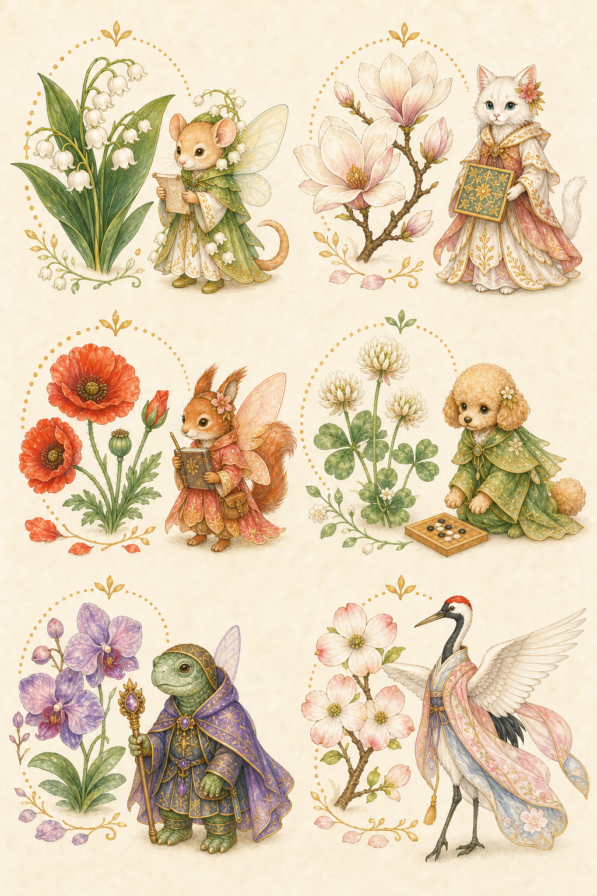

# 追加先生用 内部ストック案 2026-07-02

目的: 先生が2人増えた時に備えて、花と妖精の候補を先に決めておく。

方針:

- 既存5人の先生、既存の先生の輪、既存の保存データは変えない。
- 新しい先生は、まず追加先生枠として扱う。
- 1先生につき、5回・10回・15回の3巡分をセットで持つ。
- 画面にはまだ出さず、内部ストックとして保管する。
- 花図鑑に出すのは、実際に先生へ割り当ててからにする。

確認画像:

## 採用候補

| 仮枠 | 巡目 | 花 | 妖精・仲間 | 役割イメージ | 状態 | メモ |
| --- | --- | --- | --- | --- | --- | --- |
| 新先生A | 1巡目 | すずらん | ネズミ妖精 | 読みを整える | hidden | 小さく静かな案内役。初回の花に向く。 |
| 新先生A | 2巡目 | 木蓮 | 白猫妖精 | 形を守る | hidden | 落ち着きと品があり、先生紹介と合わせやすい。 |
| 新先生A | 3巡目 | ひなげし | リス妖精 | 記録をしまう | hidden | 進歩や記録の印象を出しやすい。 |
| 新先生B | 1巡目 | 白詰草 | トイプードル妖精 | 対局を見守る | hidden | 神社の狐と役割が重ならず、やさしい雰囲気。 |
| 新先生B | 2巡目 | 蘭 | 亀妖精 | じっくり形を育てる | hidden | 粘り強さ、落ち着き、形の学びに合う。 |
| 新先生B | 3巡目 | 花水木 | 鶴妖精 | 静かに見守る | hidden | 鶴自身の翼を生かす。別の妖精羽は付けない。 |

## 状態の意味

| 状態 | 意味 |
| --- | --- |
| hidden | 内部候補。利用者画面には出さない。 |
| assigned | 先生に割り当て済み。まだ本番表示前。 |
| active | 花図鑑・報酬判定に出す。 |

## 実装前に確認すること

- 新先生の名前、段位、写真、紹介文。
- どちらの先生に新先生A/Bを割り当てるか。
- 新先生を先生の輪に入れるか、追加先生枠にするか。
- 旧バックアップに新先生IDがない時、0回で補完できるか。
- 花・妖精を個別素材化する時、6組それぞれの花画像と妖精画像を分けて作る。

## 決定済みメモ

- 6組すべて採用候補にする。
- 白詰草はそのまま使う。
- 白詰草の仲間は狐ではなくトイプードルにする。
- 花水木の鶴は、背中に別の妖精羽を付けず、鶴自身の翼を生かす。
