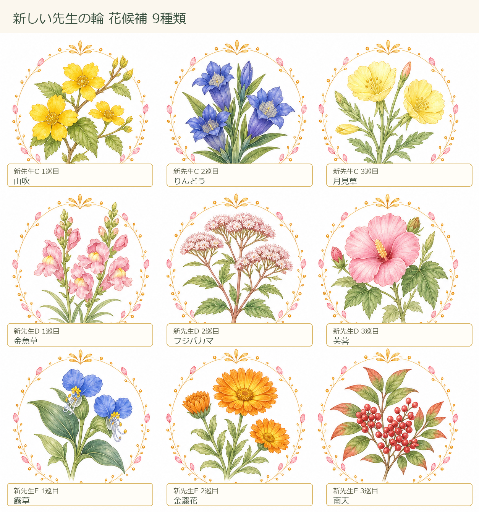
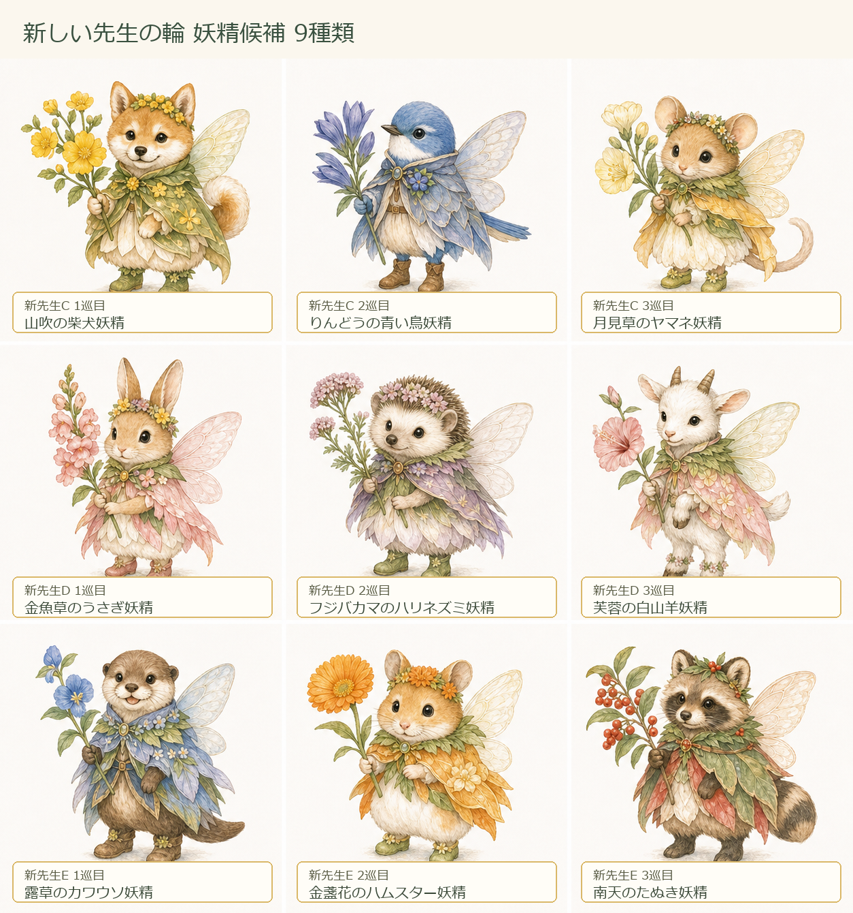

# 新しい先生の輪 候補 2026-07-03

目的: 既存5人の先生の輪を崩さず、追加先生5人で別の「新しい先生の輪」を作れるようにする。今回は先に花と妖精だけを確認する。

## 方針

- 既存5人の先生の輪は変更しない。
- 追加先生A/Bに加えて、新先生C/D/Eの3人分を用意する。
- 写真が未確定の先生は、人型の影・シルエット枠で表示する想定。
- 1先生につき3巡分の花と妖精を持つ。
- 画面実装は、花と妖精候補を確認してから進める。

## 新しい先生の輪 仕様案

- 既存の「先生の輪」は、常石先生・結城先生・小池先生・山城先生・松本先生の5人だけで維持する。
- 追加先生A/B/C/D/Eの5人で、別の「新しい先生の輪」を作る。
- 追加先生A/Bは、すでに作ったすずらん・木蓮・ひなげし、白詰草・蘭・花水木のセットを使う。
- 新先生C/D/Eは、下の9組を候補にする。
- 新しい先生の輪の達成条件は、追加先生5人それぞれ1回ずつ指導碁スタンプを得たら1巡とする案。
- 既存の先生の輪の達成数・勲章・称号・保存データには影響させない。
- 写真未確定の先生カードは、人型の影を入れた仮写真枠にする。
- 実先生の写真が入ったら、同じ先生IDの写真だけ差し替える。

## 新しい先生の輪 5人分

| 仮枠 | 1巡目 | 2巡目 | 3巡目 | 状態 |
| --- | --- | --- | --- | --- |
| 追加先生A | すずらん × ネズミ妖精 | 木蓮 × 白猫妖精 | ひなげし × リス妖精 | 作成済み |
| 追加先生B | 白詰草 × トイプードル妖精 | 蘭 × 亀妖精 | 花水木 × 鶴妖精 | 作成済み |
| 新先生C | 山吹 × 柴犬妖精 | りんどう × 青い鳥妖精 | 月見草 × ヤマネ妖精 | 候補確認中 |
| 新先生D | 金魚草 × うさぎ妖精 | 藤袴 × ハリネズミ妖精 | 芙蓉 × 白山羊妖精 | 候補確認中 |
| 新先生E | 露草 × カワウソ妖精 | 金盞花 × ハムスター妖精 | 南天 × たぬき妖精 | 候補確認中 |

## 新先生C/D/E 候補

| 仮枠 | 巡目 | 花 | 妖精 | 役割イメージ |
| --- | --- | --- | --- | --- |
| 新先生C | 1巡目 | 山吹 | 柴犬妖精 | 元気に入口へ案内する |
| 新先生C | 2巡目 | りんどう | 青い鳥妖精 | 読みを遠くまで見る |
| 新先生C | 3巡目 | 月見草 | ヤマネ妖精 | 静かな集中を守る |
| 新先生D | 1巡目 | 金魚草 | うさぎ妖精 | 一手の勢いを育てる |
| 新先生D | 2巡目 | 藤袴 | ハリネズミ妖精 | 記録をていねいに残す |
| 新先生D | 3巡目 | 芙蓉 | 白山羊妖精 | やわらかく形を整える |
| 新先生E | 1巡目 | 露草 | カワウソ妖精 | 楽しく対局へ入る |
| 新先生E | 2巡目 | 金盞花 | ハムスター妖精 | 小さな積み重ねを集める |
| 新先生E | 3巡目 | 南天 | たぬき妖精 | 旅の節目を見守る |

## 確認画像

