# 水曜会 8月30日 完成・未完成 樹形図

## 結論

参加者用アプリ本体は完成している。8月30日の実働前に残っている中心は、最終QRの印刷、当日資料のSafari方針への統一、前日・当日朝の確認である。

```mermaid
flowchart LR
    ROOT["8月30日の実働準備"]

    ROOT --> DONE["✅ 完成している"]
    ROOT --> REMAIN["🟠 実働前に残っている"]
    ROOT --> FUTURE["⏸️ 今回は完成させなくてよい"]

    DONE --> APP["参加者用アプリ Ver.1"]
    APP --> APP1["花図鑑・冒険者カード"]
    APP --> APP2["参加・先生スタンプ"]
    APP --> APP3["妖精・勲章・称号"]
    APP --> APP4["今日の記録"]

    DONE --> DATE["日付を跨ぐ動作"]
    DATE --> DATE1["今日の記録は翌日に消える"]
    DATE --> DATE2["累計スタンプと獲得品は残る"]
    DATE --> DATE3["2026年7月8日の実機確認に合格"]

    DONE --> QR["QRの主要系統"]
    QR --> QR1["アプリ入口QR"]
    QR --> QR2["受付用参加QR"]
    QR --> QR3["先生ごとの固定QR"]
    QR --> QR4["対局内容QR"]
    QR --> QR5["再読取で二重に増えない"]

    DONE --> ADMIN["運営・安全対策"]
    ADMIN --> ADMIN1["管理パスコード"]
    ADMIN --> ADMIN2["下書き・確定保存"]
    ADMIN --> ADMIN3["バックアップ・復元"]
    ADMIN --> ADMIN4["操作履歴・誤操作防止"]
    ADMIN --> ADMIN5["実地運用の通し試験"]

    DONE --> PUBLIC["公開とスマホ確認"]
    PUBLIC --> PUBLIC1["GitHub Pagesで公開済み"]
    PUBLIC --> PUBLIC2["iPhone Safari実機確認に合格"]
    PUBLIC --> PUBLIC3["Safari案内を公開済み"]
    PUBLIC --> PUBLIC4["先生共有タイムアウト対策に合格"]

    REMAIN --> PAPER["最終QRと印刷物"]
    PAPER --> PAPER1["本番URLから当日用QRを作る"]
    PAPER --> PAPER2["実際の紙・プリンターで印刷"]
    PAPER --> PAPER3["先生名・日付・QRの大きさ確認"]
    PAPER --> PAPER4["受付用と先生用を分けて配置"]

    REMAIN --> RULE["古い案内文の整理"]
    RULE --> RULE1["最新方針は「iPhoneはSafariで使う」"]
    RULE --> RULE2["古い資料には「ホーム画面へ追加」が残る"]
    RULE --> RULE3["当日資料とスタッフ説明を最新方針へ統一"]

    REMAIN --> REHEARSAL["前日・当日朝の確認"]
    REHEARSAL --> RE1["PC・iPhone・充電器を準備"]
    REHEARSAL --> RE2["Wi-Fiと公開URLを確認"]
    REHEARSAL --> RE3["管理パスコードを確認"]
    REHEARSAL --> RE4["開始前バックアップを保存"]
    REHEARSAL --> RE5["受付QR・先生QRを各1回読む"]
    REHEARSAL --> RE6["スタッフの声かけと役割を共有"]

    FUTURE --> TEACHER["一局のご縁帳"]
    TEACHER --> TEACHER1["画面デザイン Ver.1は完成"]
    TEACHER --> TEACHER2["先生本人の認証は未完成"]
    TEACHER --> TEACHER3["本番データとの完全連携は未完成"]

    FUTURE --> COMMENT["先生の2行コメント"]
    COMMENT --> COMMENT1["仕様と安全設計の段階"]
    COMMENT --> COMMENT2["保存処理・画面・一般アプリ接続は未実装"]

    FUTURE --> DPLAN["起動画面 D案"]
    DPLAN --> DPLAN1["探索マップを残して今日の花を目立たせる"]
    DPLAN --> DPLAN2["影響範囲調査済み"]
    DPLAN --> DPLAN3["状態別の文章候補を確認済み"]
    DPLAN --> DPLAN4["未実装・本体変更なし"]
    DPLAN --> DPLAN5["次：実装前の最終確認"]

    FUTURE --> LATER["8月30日後に検討"]
    LATER --> L1["冒険日誌"]
    LATER --> L2["見やすさ優先設定"]
    LATER --> L3["バックアップ範囲の拡張"]
    LATER --> L4["新しい大型機能"]
```

## 紙で見るための保存版

- `水曜会_8月30日_完成・未完成_樹形図_2026-07-27.docx`
- `水曜会_8月30日_完成・未完成_樹形図_2026-07-27.pdf`

## 関連記録

- [[2026-07-28 GitHub公開リポジトリ研究と起動画面D案 設計判断記録]]
- [[2026-07-27 水曜会 8月30日 新しい運営手順マップ]]
- [[2026-07-24 Safariとホーム画面版 保存領域分離の確認]]
