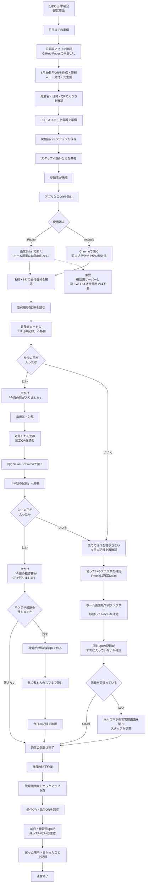

# 水曜会 8月30日 新しい運営手順マップ

## 正式な当日方針

- GitHub Pagesの公開版を使う。
- iPhoneは通常Safariで使う。
- ホーム画面には追加しない。
- AndroidはChromeで開き、同じブラウザを使い続ける。
- 確認用サーバーと同一Wi-Fiは通常運用では不要。

## 紙で見るための保存版

- `水曜会_8月30日_新しい運営手順マップ_2026-07-27.docx`
- `水曜会_8月30日_新しい運営手順マップ_2026-07-27.pdf`

## 関連記録

- [[2026-07-27 水曜会 8月30日 完成・未完成 樹形図]]
- [[2026-07-24 Safariとホーム画面版 保存領域分離の確認]]

